# COCKROACHDB

### INSTALL
1. install docter for windows
Docker for Windows requires 64bit Windows 10 Pro and Microsoft Hyper-V. Please see the official documentation for more details. Note that if your system does not satisfy the stated requirements, you can try using Docker Toolbox.

2. Open PowerShell and confirm that the Docker daemon is running in the background:
PS C:\Users\username> docker version

3. Share your local drives. This makes it possible to mount local directories as data volumes to persist node data after containers are stopped or deleted.

4. Pull the image for the v19.1.5 release of CockroachDB from Docker Hub:
PS C:\Users\username> docker pull cockroachdb/cockroach:v19.1.5

5. Keep up-to-date with CockroachDB releases and best practices:

### KONFIGURASI

1. pertama jalankan perintah pull image
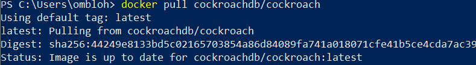
 disini karna sebelumnya sudah di install jadi tampilan seperti in jika belom pernah maka tampilan seperti in
 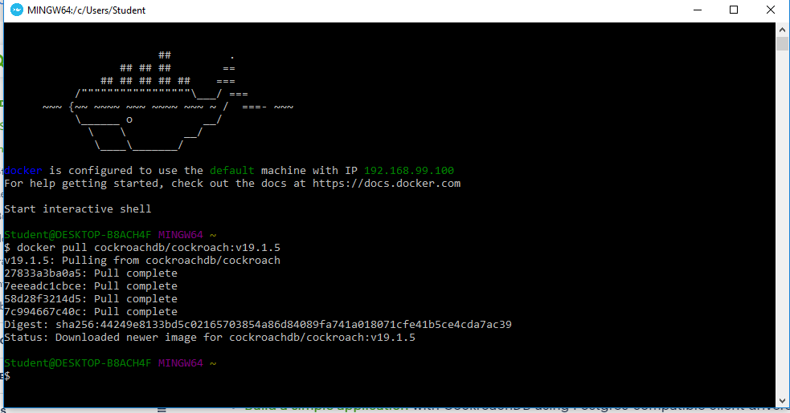

 2. kemudian cek image apakah sudah terdownload 
  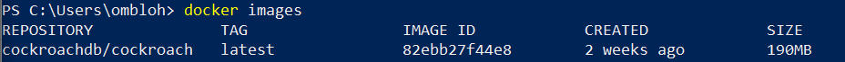
3.  kemudian jalankan container cockroachdb dan cek apa kah berjalan
  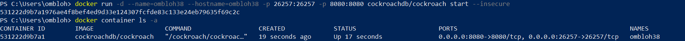
4. kemudian masuk ke container yang kita buat tadi

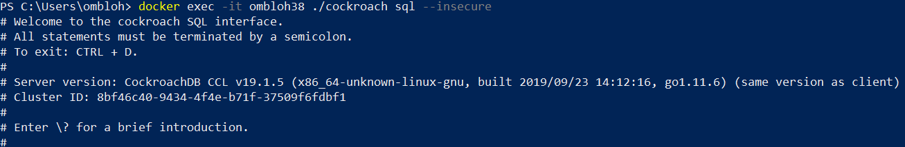

### MEMBUAT DATABASE
membuat database dan menggunakan nya
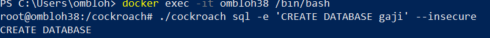
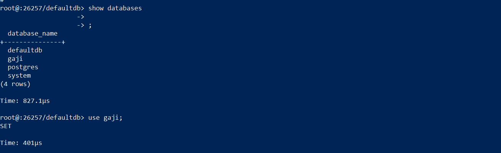

### MEMBUAT TABEL
membuat table pada database tadi
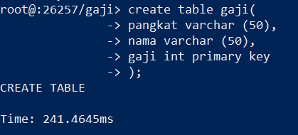

### MENGISI DATA
mengisi data pada table
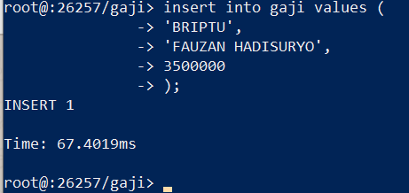

melihat table
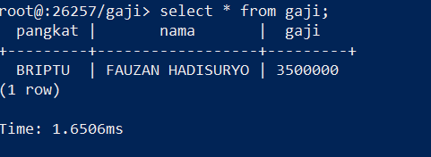
### MENGECEK PADA LOCALHOST KITA

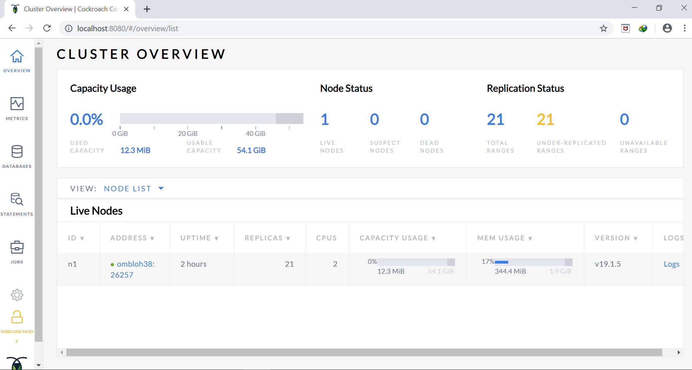
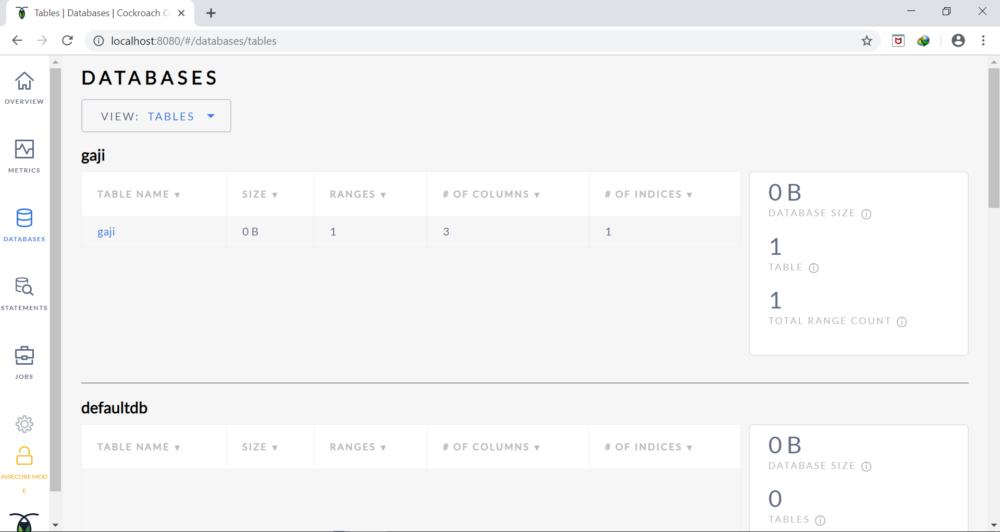