# MWMBUAT TUGAS SESUAI LINK DI BAWAH

    1. https://www.katacoda.com/courses/docker/deploying-first-container
    2. https://www.katacoda.com/courses/docker/create-nginx-static-web-server
    3. https://www.katacoda.com/courses/docker/2

 ## LINK 1

 pull redist

 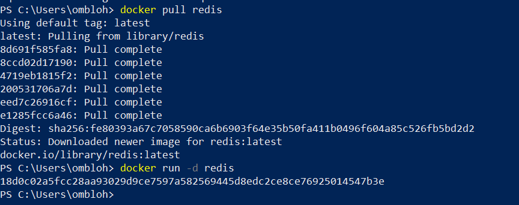

menjalankan image redis

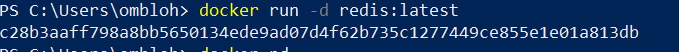

melihat container yang sedang berjalan

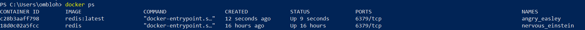

menjalankan bebrapa container

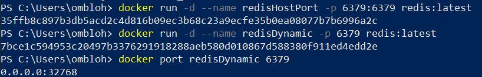

melihat container yang sedang berjalan

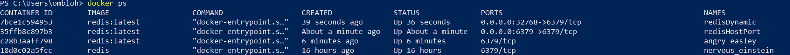

persiting data

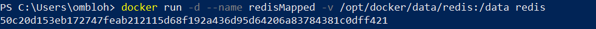

Running A Container In The Foreground

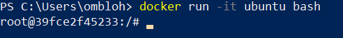

 ## LINK 2
 membuat dockerfile

 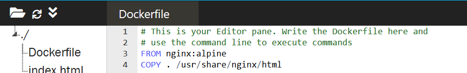

 membuat docker image 

 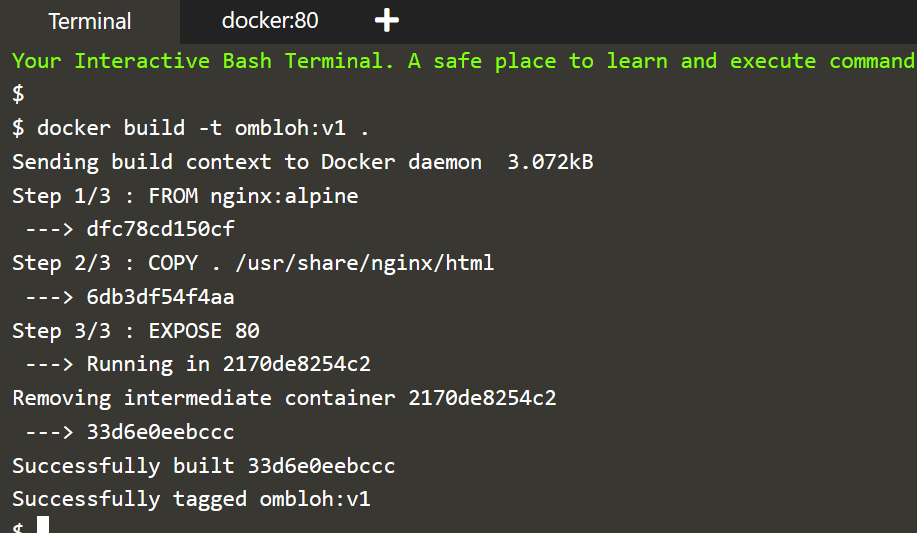

 menampilkan isi dari images

 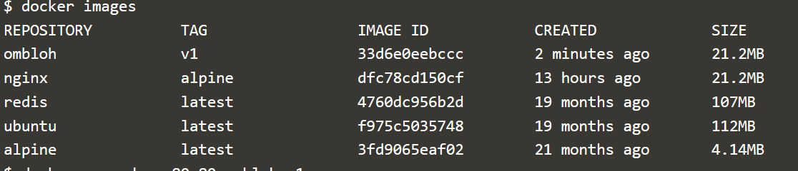

menjalankan image menjadi container

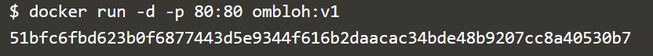

membuka halaman dengan curl

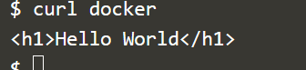

 ## LINK 3
membuat docker file,menjalankan perintah menambhkan port yang dibuka dan menambahkan default commands

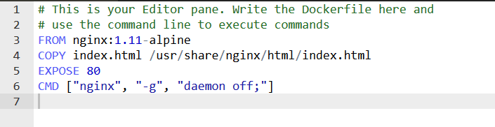

membuat image dari docker file

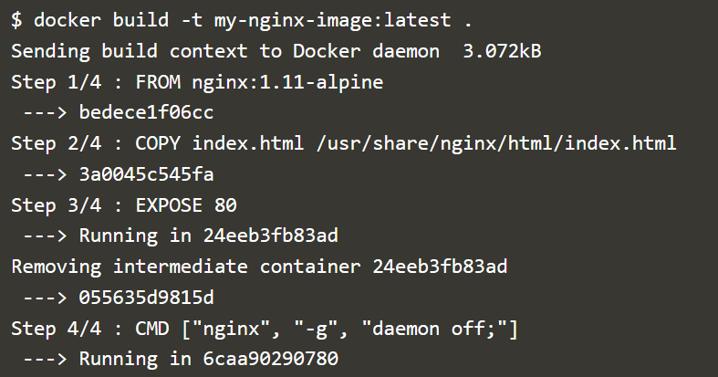
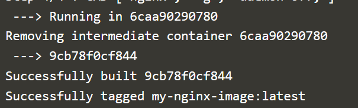

melihat image yang dibuat tadi

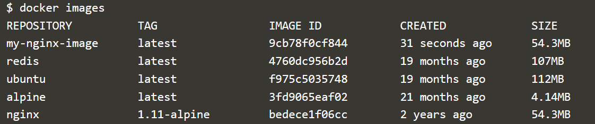

menjalankan conteiner yang dibuat tadi

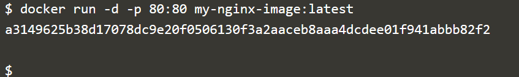

melihat container berjalan

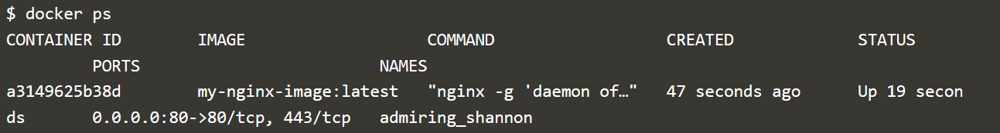

melihat halaman docker dengan curl

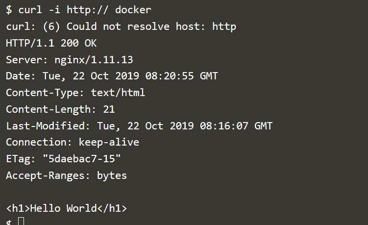

