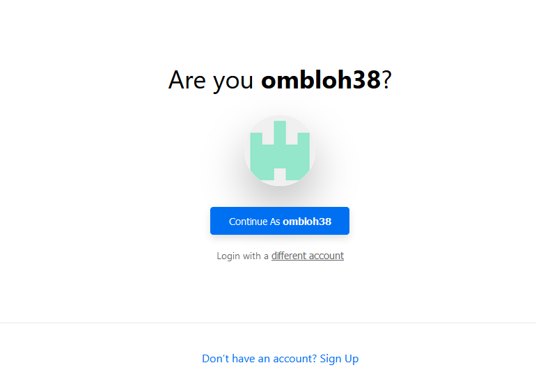
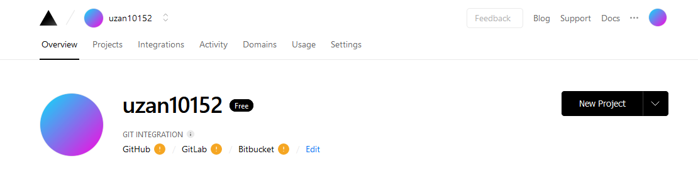
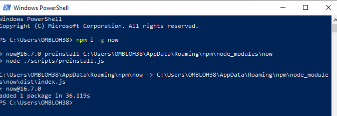
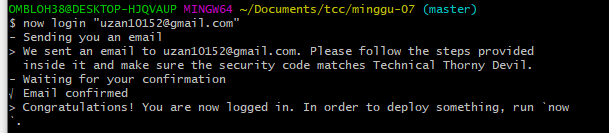
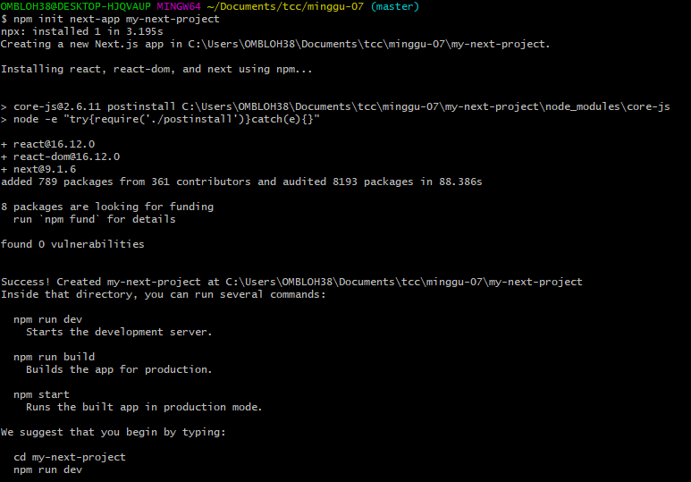
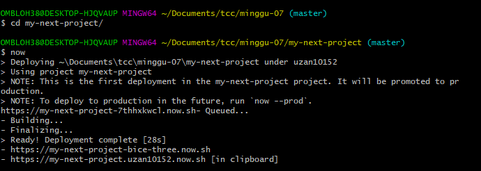

# PERTEMUAN KE 7

## 1 daftar zeit.co

## 2 install node.js
link download https://nodejs.org/en/download/

## 3 install now-cli dengan npm
pastikan node sudah terinstall

## 4 now login

jangan lupa confirm lewat email karna tidak berjalan jika belum di confirm lewat email

## 5 membuat project baru

## deploy project tadi dengan now

hasil nya https://my-next-project.uzan10152.now.sh