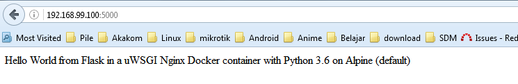

# MINGGU 09
# MELANJUTKAN MINGGU 08   
# PYTHON FT. FLASK 

1. login ke Docker `docker login`  
<pre>
$ docker login
Authenticating with existing credentials...
WARNING! Your password will be stored unencrypted in C:\Users\lukmanPC\.docker\c
onfig.json.
Configure a credential helper to remove this warning. See
https://docs.docker.com/engine/reference/commandline/login/#credentials-store

Login Succeeded
</pre>  
2. Push image ke Docker Hub  `docker push ombloh38/python-flask:v1`  
<pre>
$ docker push ombloh38/python-flask:v1
The push refers to repository [docker.io/ombloh38/python-flask]
201878cc5b39: Layer already exists
6491bf786178: Layer already exists
03e27abc14cd: Layer already exists
9e1997504a36: Layer already exists
afafdd57788e: Layer already exists
88ffe55f8636: Layer already exists
9645f48ac45f: Layer already exists
e1c78b268584: Layer already exists
0a20307a8580: Layer already exists
f9b3c92a17fa: Layer already exists
8e419e3a6eff: Layer already exists
9f9824dded62: Layer already exists
4be28133a48e: Layer already exists
44baabe6f6aa: Layer already exists
848ed578d6a7: Layer already exists
06ff6945efba: Layer already exists
c7831e67c104: Layer already exists
4e981b96f251: Layer already exists
b15402eeb9fb: Layer already exists
9c2123bd22f4: Layer already exists
a11e869e648d: Layer already exists
50f8b07e9421: Layer already exists
629164d914fc: Layer already exists
v1: digest: sha256:eb1fcee937603bd13b8775001fed8f35f5ecf6dd3dddc44d9be291f677d2d
b18 size: 5123

lukmanPC@GATHOT-KOCO MINGW64 ~/Documents/tcc/minggu-08/FlaskApp (master)
</pre>  
3. Cek image di docker hub.     
  
6. Menjalankan image menjadi container  `docker run -d -p 5000:80 --name=python-flask ombloh38/python-flask:v1` (windows --> virtualbox (port 5000)--> container flask (port 80))  
<pre>
lukmanPC@GATHOT-KOCO MINGW64 ~/Documents/tcc/minggu-08/FlaskApp (master)
$ docker run -d -p 5000:80 --name=python-flask ombloh38/python-flask:v1
646d65b23cb357339f43b3546e8c3d038187cb47fc04734b08dba845733ffd35
</pre>  
7. Cek Container yang sedang berjalan `docker ps`  
<pre>
lukmanPC@GATHOT-KOCO MINGW64 ~/Documents/tcc/minggu-08/FlaskApp (master)
$ docker ps
CONTAINER ID        IMAGE                          COMMAND                  CREATED             STATUS              PORTS                           NAMES
4687d1ec8264        ombloh38/python-flask:v1   "/entrypoint.sh /sta…"   2 minutes ago       Up 2 minutes        443/tcp, 0.0.0.0:5000->80/tcp   python-flask
</pre>  
8. Cek di browser dengan akses `http://192.168.99.100:5000/`  
  

