# UTS

1. MEMBUAT FOLDER FILE DOCKERFILE
membuat folder dan membuat file bernama docker dengan notepad dengan memasukan script berikut
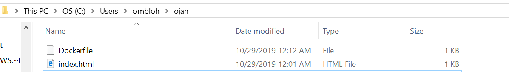
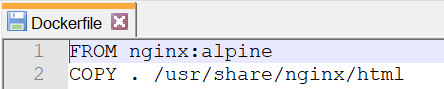

2. MENYIAPKAN FILE HTML
dengan script berikut
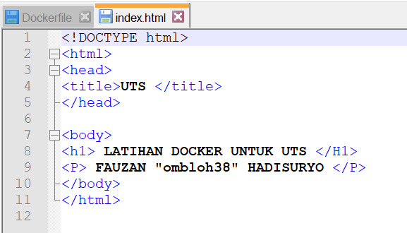

3. LOGIN/MENDAFTAR DI DOCKER HUB
hub.docker.com
 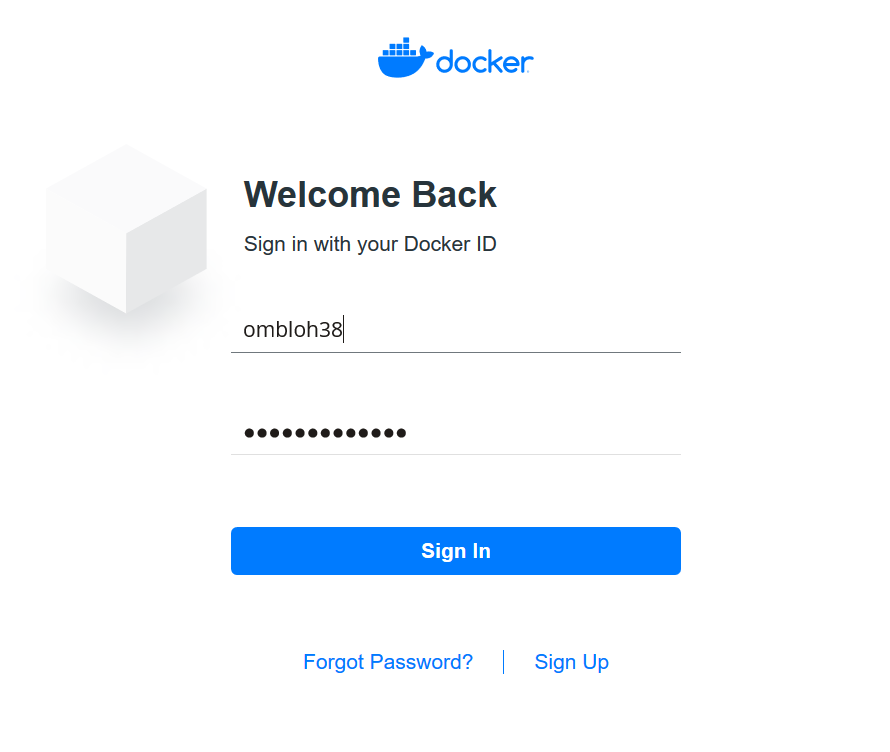

4. MEMBUAT REPOSITORY DI DOCKERHUB
 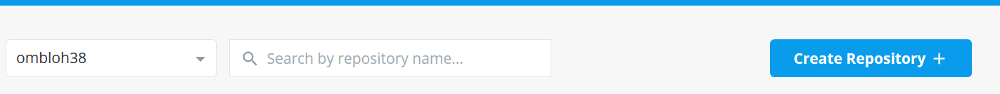
 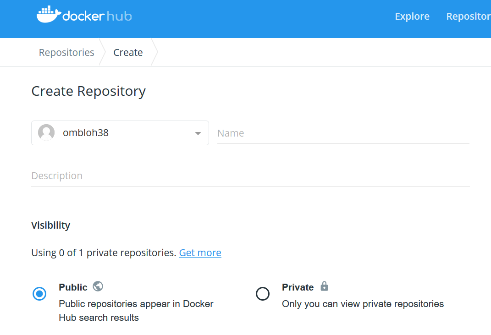

5. BUILD DOCKER IMAGES
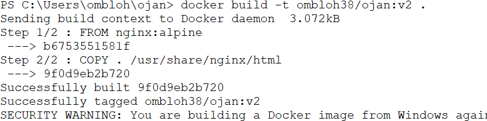

6. MELIHAT APA SUDAH ADA
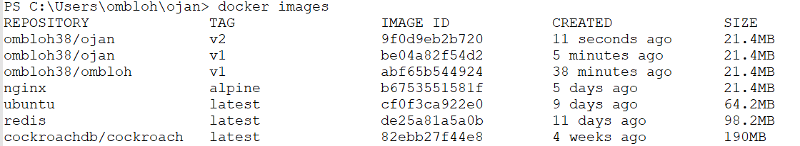

7. MENJALANKAN IMAGES
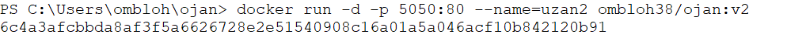

8. LOGIN
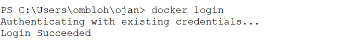

9. TAG DAN PUSH
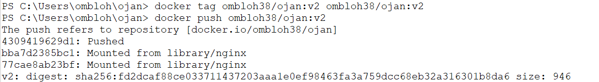

10. CEK BROWSER
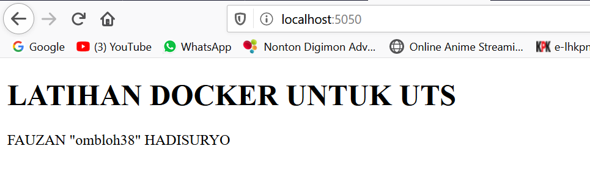